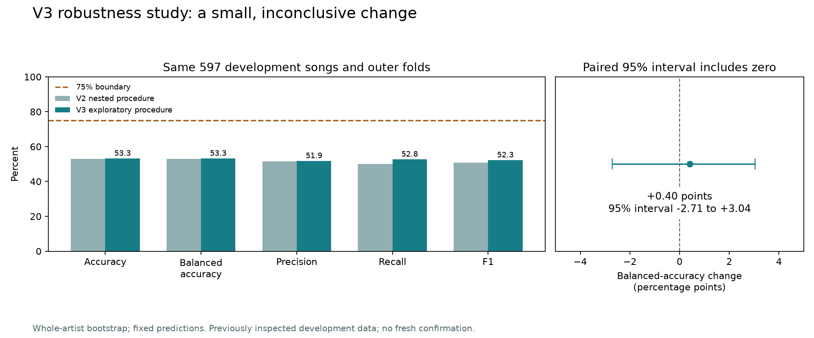

# V3 robustness study — 2 October 2026

The expanded study produced **53.25% nested balanced accuracy**, compared with **52.85%** for V2. The difference is **+0.40 percentage points**, with a paired approximate 95% interval of **-2.71 to +3.04 points**. This does not establish a reliable improvement. The strict five-metric >75% target remains unmet.

## What was tested

All 35 original V2 candidates remained eligible. Twenty fixed additions tested normal quantile transformations, mean/median/standard-deviation feature subsets (222 columns), covariance shrinkage, regularized histogram gradient boosting, reduced-space nearest neighbors and smaller mutual-information feature sets. The development-only tail audit found 11 features with an extreme value more than 20 interquartile ranges from the median. That motivated the experiment without establishing a cause of poor prediction.

`configs/v3_robust.json` was committed before execution. The study retained the original 597 development songs, 52 normalized artist groups, five outer / three inner folds, seeds and native thresholds. All learned transforms were fitted inside training folds. The 55 candidates completed **1059 recorded fits**, with **0 failed trials** and **0 trial warnings**. Runtime was **129.87 seconds** including startup. Two CPU workers and unchanged dependencies were used.

## Results and their limits

| Metric | V2 nested | V3 nested | V3 approximate 95% interval | V3 >75%? |
| --- | ---: | ---: | ---: | --- |
| Accuracy | 52.93% | 53.27% | 47.79%–58.19% | No |
| Balanced Accuracy | 52.85% | 53.25% | 47.78%–58.16% | No |
| Precision | 51.60% | 51.86% | 43.88%–59.31% | No |
| Recall | 50.00% | 52.76% | 45.38%–59.28% | No |
| F1 | 50.79% | 52.31% | 45.47%–58.11% | No |

The paired procedures changed 108 predictions and produced only 2 additional correct predictions overall. Class-1 recall increased while class-0 recall decreased. Whole-artist bootstrap intervals condition on fixed predictions and omit some training and selection uncertainty. The development data had already been inspected in V2, so V3 is an exploratory follow-up, even though its inner/outer folds remain correctly separated.

**The final model configuration stayed `lr_mi_50`**: logistic regression, C=0.1, with 50 selected features. Its final learned imputation, variance, scaling, mutual-information scores, coefficients and intercept matched V2 exactly in the recorded comparisons, and all 597 development predictions and scores were identical. Serialized pipeline bytes have different hashes; numerical equivalence is based on the explicit state and prediction checks, not byte identity. The small nested change concerns the expanded selection procedure across outer folds and does not establish a better final deployed model.

The best newly added full-development tuning setting was `v3_lr_mi10_0.01` at **52.76%** mean fold balanced accuracy, below the incumbent's **52.88%**. Tuning scores are not independent performance estimates. No historical labels were evaluated again. No fresh collection exists. The active demo remains `v1_baseline`, with clearly labelled V2 and V3 research options.

## Software, evidence and sources

The new tests check that quantiles do not learn from validation inputs, all 20 additions clone and reload with consistent predictions, the full raw input schema is retained, and internal random early stopping is disabled. A dedicated app check verifies the V3 run identity, 55-setting method description and exploratory qualifier. Exact final test results are in `results/research_v3/final_test_command.json` and `final_tests.log`.

Evidence: `results/v2/v3_nested_001/` contains the immutable run, all trial records and fold memberships. `results/research_v3/paired_comparison.json`, `metrics_comparison.csv`, `preflight.json`, `evidence.json` and the exact executed source archive make the comparison traceable. Original V1/V2 measurements remain preserved. This study is saved on local branch `research/chorus-v3`; GitHub authentication was previously blocked, and this study has not been published.

Methods: [scikit-learn quantile transformations](https://scikit-learn.org/stable/modules/generated/sklearn.preprocessing.QuantileTransformer.html), [histogram boosting](https://scikit-learn.org/stable/modules/generated/sklearn.ensemble.HistGradientBoostingClassifier.html), [discriminant analysis and shrinkage](https://scikit-learn.org/stable/modules/lda_qda.html). These methods can help on some datasets; their documentation does not promise better hit prediction.

## What would enable the next useful experiment

The user confirmed there are no recordings available. The pinned original repository contains no audio files. The inspected ISMIR/MSD release supplies features and different labels, so it cannot substitute for matching chorus recordings. See `V3_DATA_SOURCE_REVIEW.md` for links, access limitations and the recorded source inventory.

The next input is a collection of permitted recordings with recording/version identities, credited performer evidence and verified labels. Re-extract one consistent feature set, compare richer frozen audio representations against a matched baseline, and reserve new data before choosing the final model. Until then, another broad search over these same features has no demonstrated route to 75%. No score or dataset size is promised.
