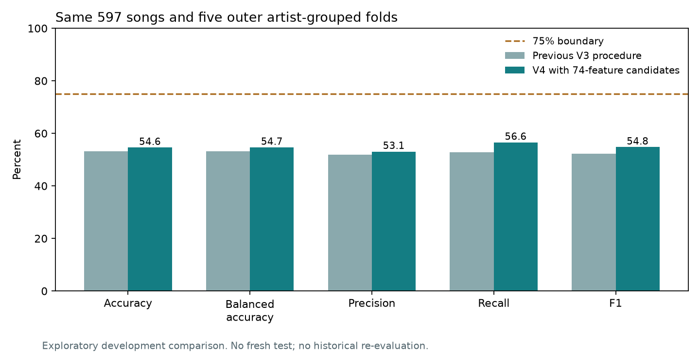

# Archive-inspired 74-feature experiment - 4 October 2026

## Outcome

The declared V4 selection procedure achieved **54.66% balanced accuracy** and **54.61% ordinary accuracy**, versus V3's 53.25% and 53.27%. The paired balanced-accuracy change is **+1.41 percentage points**, with an approximate 95% whole-artist interval of **-4.29 to +7.33 points**. The interval includes zero; a reliable improvement is not established.

## Protocol and changes

The task remains source year-end hit versus other charted song. The same 597 development songs and 52 artist-name groups, five outer folds, three inner folds, seeds and native thresholds were retained. All 55 V3 candidates remained eligible. Eight additions used the 74 standard-deviation features, balanced logistic regression, standard or 100-quantile normal scaling, and C in 0.003, 0.01, 0.03, 0.1. The raw input contract remains 518 columns; each new pipeline selects 74 internally. Every learned transform fits only its training fold.

`configs/v4_std74.json`, estimator support and isolation tests were committed at `8166b7bbbd1f47b598998db1564ab4e3dc551c69` before execution. The nested run completed 1203 recorded fold fits plus one final refit in 128.93 seconds, with 0 failed fold fits and 0 fit warnings. The separate, predeclared fixed-candidate diagnostic completed ten fits. Search selection uses inner-fold balanced accuracy, not outer diagnostic scores.

| Metric | Previous V3 | V4 expanded procedure |
| --- | ---: | ---: |
| Accuracy | 53.27% | 54.61% |
| Balanced Accuracy | 53.25% | 54.66% |
| Precision | 51.86% | 53.07% |
| Recall | 52.76% | 56.55% |
| F1 | 52.31% | 54.76% |

V4 balanced-accuracy interval: 50.72%-58.50%. Changed outer predictions: 178; net additional correct predictions: 8. A new 74-feature candidate won 4 of five inner selections. Final full-development selection: **v4_lr_std74_standard_0.1**, retaining 74 features. Final development predictions equal the previous fitted model: False; scores equal: False.

## Fixed candidate diagnostic

On the same five outer folds, the archive's C=0.1/quantile-100 model scored **56.51% balanced accuracy** and 56.45% ordinary accuracy; the frozen incumbent scored **53.19% balanced accuracy** and 53.27% ordinary accuracy. The paired BA difference is +3.31 points, interval -1.67 to +8.54. These are descriptive fixed-model results, distinct from the nested selection procedure. They were not used to choose the final model. All ten fitted models reproduce saved predictions after reload; training-only feature/imputation/quantile boundaries were checked.

## Interpretation and limits

The archive's 57.13% was a selection-CV mean, not a nested or new-test estimate. The highest added full-development tuning candidate here is `v4_lr_std74_standard_0.1` at 53.67%; this also is a tuning score. No favourable seeds, thresholds, labels or songs were selected after seeing these results. The five-metric strict >75% target is not met.

These data and earlier archive results have already been inspected. Bootstrap intervals condition on saved predictions and do not capture all model-selection/training uncertainty. Artist-name identity and chart labels remain incompletely verified; original matching recordings and a genuinely new evaluation collection are missing. No new historical evaluation or fresh-test claim is made. The active demo remains `v1_baseline`; V4 is an optional research run.

## Reproduction and status

- Implemented and run: 74-feature pipelines, bounded nested search, paired comparison, fixed-candidate diagnostic, reload and input-boundary checks.
- Blocked: matched-audio representations and independent confirmation need verified matching recordings, credited-performer/recording identities, chart evidence and new evaluation songs.
- Not attempted: changing the target, new historical scoring, or automatic model promotion.
- Commands: `.venv/bin/python -m chorus_hit.train_v2 --config configs/v4_std74.json --run-id v4_std74_001`; `.venv/bin/python scripts/summarize_std74.py`; `.venv/bin/python -m pytest -q`.
- The completed run refuses overwriting; reproduce in a disposable checkout with this run absent or choose a new run ID and adapt the comparison script. Pinned dependencies are unchanged. Final test evidence is in `results/research_v4/final_tests.log`.
- Evidence: `results/v2/v4_std74_001/`, `results/research_v4/comparison.json`, fixed-candidate predictions/models, training log, executed-source archive and preservation hashes. Current local branch: `research/std74-evaluation`.

Next action: use this result to decide whether this representation merits testing on verified new data. Prioritize recording/label verification and matched permitted audio; another search on the same songs cannot supply independent confirmation.

## Final verification

The complete suite passed **29 tests** in **15.19 seconds**, with four existing audio dependency/deprecation warnings. The V4 demo option displays the validated run's score, 63-setting method and exploratory qualifier. All 2,202 protected pre-existing file hashes remain unchanged. Source and evidence were uploaded on 4 October to [`research/chorus-v3`](https://github.com/DhanushSS/chorus-hit-predictor/tree/research/chorus-v3) in [PR #1](https://github.com/DhanushSS/chorus-hit-predictor/pull/1), without merging into `main`. The local working branch is `research/std74-evaluation`. The original active model remains unchanged.
