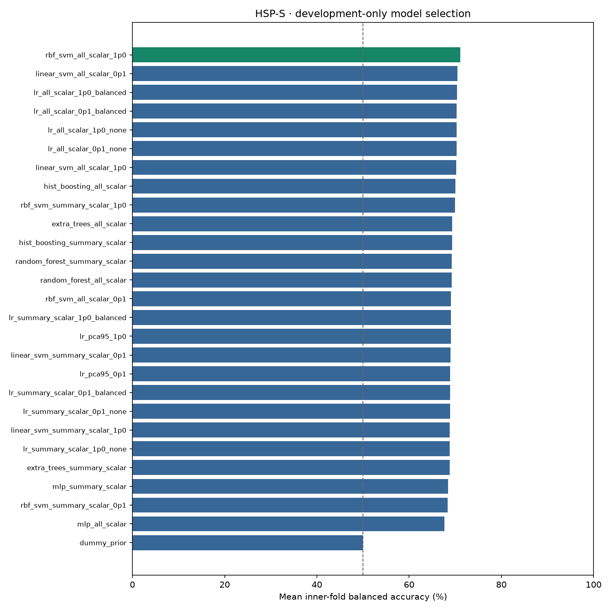
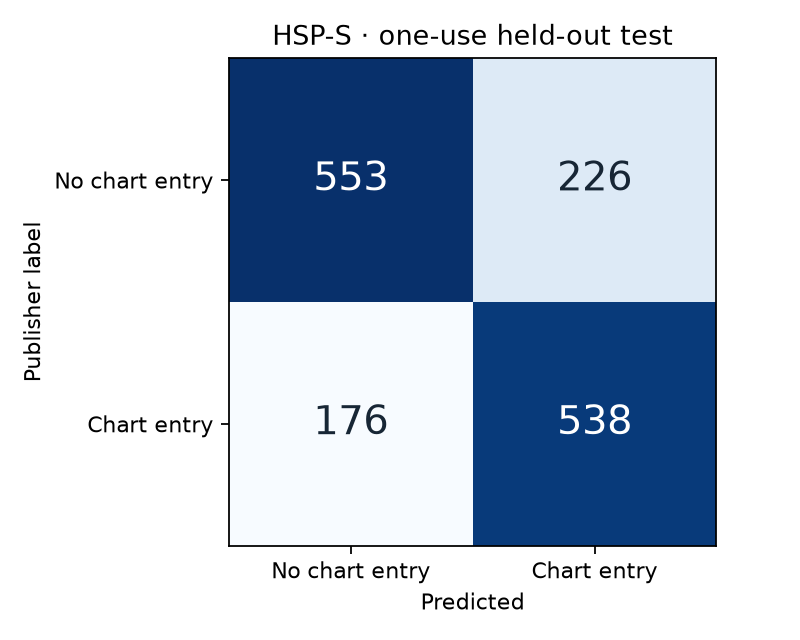

# HSP-S results and completion report

**Status: TRAINED_AND_LOCKED_TESTED**. Separate experiment approved on 10 October 2026.

## Dataset and method

- Source: **7,736 published HSP-S rows**; whole-recording Essentia features.
- Accepted: **7728** — 3865 charted / 3863 without chart entries.
- Excluded: 8 duplicate/conflicting records; reasons are in `results.json`.
- 2633 connected artist/recording/album groups; largest component 636 songs.
- Development: 6235 songs / 2106 groups.
- Locked holdout: 1493 songs / 527 groups.
- 436 numeric scalar audio descriptors. Metadata, chart outcomes, listening counts and high-level classifier outputs excluded from predictors.
- 27 preregistered model configurations; five outer / three inner group folds; seed 20261008.
- Missing-value handling, scaling, feature filtering and PCA fitted inside training folds only.
- Downloaded audio: **0**. New 15-second chorus features: **0**. This is not the 278-song chorus experiment.

## Results

Selected configuration: `rbf_svm_all_scalar_1p0`.

| Metric | Training (optimistic resubstitution) | Nested development | Locked test |
| --- | ---: | ---: | ---: |
| accuracy | 79.60% | 70.97% | 73.07% |
| balanced accuracy | 79.55% | 70.94% | 73.17% |
| precision | 77.38% | 70.18% | 70.42% |
| recall | 84.26% | 74.01% | 75.35% |
| f1 | 80.67% | 72.04% | 72.80% |
| macro f1 | 79.54% | 70.93% | 73.07% |
| roc auc | 87.24% | Not available | 80.76% |
| average precision | 84.52% | Not available | 79.00% |

The nested result estimates model selection across unseen connected groups. Final
candidate selection uses development folds only. Training metrics are not evidence
of generalization. Fixed native thresholds were used; scores are uncalibrated.

Final-test access: **USED_ONCE**. Review flags: `[]`.
Group-bootstrap intervals and per-class results are in `results.json`.
See [completion and verification details](handoff.md) for the app check, exact
test commands, remaining blockers and interpretation of the bias diagnostics.

## Verification and reproduction

Source publisher MD5: `c3372acb249f9243e92613537825ad4d`. Full source SHA-256:
`b5e79c9c929f81f145f337be7d00768205f809b43aab60609944c88ec4605df3`. No partial download was trained on.

Trial fits: 486 completed, 0 failed;
1226.1 accumulated trial seconds. Failed fits are retained,
not converted to zero scores or silently removed. The final development model
comparison and warnings are preserved locally; aggregate comparison is published.
38 trial fits emitted warnings; the warning messages
and counts are retained in `results.json`. Warnings do not mean failed fits.

[Preregistered protocol and exact CLI commands](../hsp_s_protocol.md).
[GitHub verification run](https://github.com/DhanushSS/chorus-hit-predictor/actions/runs/38046487532). The report's handoff records the checked SHA
and test results; this link identifies the exact remote workflow rather than an
older baseline check. Model and detailed local artifacts remain in ignored
`results/hsp_s/run_001`; the public repository contains code and safe aggregates.

Streamlit has a separate **Hit vs Non-Hit feature study** page. A genuinely evaluated
compatible model can classify 1–100 records with its exact ordered feature CSV.
It cannot accept MP3s under the original librosa extractor. The original audio-upload
project and its model remain intact.

## Limitations and attribution

The source labels come from publisher matching of Billboard Hot 100 records
(11 August 1958–6 July 2019) to MSD, with sampled non-hits. Missing chart fields
are not independent proof of never charting. The convenience sample, artist/genre
composition, incomplete identity tags and recording-source differences limit
generalization. Group isolation covers known source identities, not every possible
unrecorded alias or cover relationship. Codec/version/duration and permutation
diagnostics are published in `results.json`; review flags prevent test consumption.

This is retrospective classification. It does not predict future commercial
success, establish performance on new audio, or demonstrate superiority to Eric
Liu or the historical model on different datasets and evaluation protocols.

Dataset: Michael Vötter, Maximilian Mayerl, Günther Specht and Eva Zangerle (2021),
*Novel Datasets for Evaluating Song Popularity Prediction Tasks*,
[DOI 10.5281/zenodo.5383858](https://zenodo.org/records/5383858), **CC BY 4.0**.
Changes for this study: scalar-audio feature subset, documented exclusions,
connected-group partitioning, nested model selection and the evaluation above.
